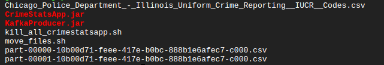

# Projekt 2 
### Zestaw number 3: Crimes-in-Chicago z wykorzystaniem Kafka Streams

## Informacje ogólne
Na początku znajduję się proces tworzenia całego środowiska, a w punkcie **Sprawozdanie** znajduję się opis kodu i rezultaty mojej pracy.


## Inicjalizacja
w termninalu Google Cloud'a wklej poniższy skryt w celu utworzenia clastra:
```
gcloud dataproc clusters create ${CLUSTER_NAME} \
--enable-component-gateway --region ${REGION} --subnet default \
--master-machine-type n1-standard-2 --master-boot-disk-size 50 \
--num-workers 2 --worker-machine-type n1-standard-2 --worker-boot-disk-size 50 \
--image-version 2.1-debian11 --optional-components ZEPPELIN,ZOOKEEPER \
--project ${PROJECT_ID} --max-age=2h \
--metadata "run-on-master=true" \
--initialization-actions \
gs://goog-dataproc-initialization-actions-${REGION}/kafka/kafka.sh
```

## Technical
Utworzy nowy terminal na klastrze, który zajmie się przygotowaniem środowiska.
\
\
Kod do sprawdzania instejących topics:
```
CLUSTER_NAME=$(/usr/share/google/get_metadata_value attributes/dataproc-cluster-name)
kafka-topics.sh --list --bootstrap-server ${CLUSTER_NAME}-w-0:9092
```
\
Kod do tworzenia potrzebnych tematów Kafki:
```
kafka-topics.sh --create --topic crimes-input --bootstrap-server localhost:9092 --partitions 1 --replication-factor 1
kafka-topics.sh --create --topic crimes-output --bootstrap-server localhost:9092 --partitions 1 --replication-factor 1
kafka-topics.sh --create --topic anomalies-output --bootstrap-server localhost:9092 --partitions 1 --replication-factor 1
```
\
**Pamiętaj o dodaniu wszystkich plików z folderu** ***importFiles***. Wejdź w zębatke w terminalu i klikni add files. Wejdź do wcześniej wskazanego folderu i zaznacz tylko **pliki** bez folderów!.
\
W celu potwierdzenia dodania plików wyświetl listę plików: `ls`


## Producer
Utworzy nowy terminal na klastrze, który zajmie się produkcją danych. 
Cała aplikacja znajduję się w folderze *Producer*. Jednak jeśli wszystko pobraliśmy z folderu *importFiles*, znajduję się tam plik *KafkaProducer.jar*, który 
będzie tworzył nam dane na temat ***kafka-input***. Zanim go wywołamy musimy zaciągnąć dane, mamy na to dwie opcje:
**Wykonaj tylko jedno!**
1. Dane z orginalego folderu (kilka plików do testów): folder -> ***crimes-in-chicago_files***
\
Należy przesłać terminala te pliki, które chcemy przetwarzać. Ich nazwa musi być zgoda z formatem orginalnych plików: `part-*-*.csv`. Można wybrać poszczególne pliki lub zaznaczyć wszystkie z tego folderu
\
Przykład:



W celu przeniesienia plików należy wykonować poniższy kod:
```
chmod +x move_files.sh
./move_files.sh
```
Utworzy to folder o nazwie:  *crimes-in-chicago_result* w którym znajdują się plik csv.

2. Bucket 
\
Moja struktura bucketu:

\
Komenda do pobrania danych:
``` 
hadoop fs -copyToLocal gs://{bucket_name} ~
```

Teraz już tylko wystarczy odpalić naszego **producera!!!**.
```
CLUSTER_NAME=$(/usr/share/google/get_metadata_value attributes/dataproc-cluster-name)
java -cp /usr/lib/kafka/libs/*:KafkaProducer.jar \
 com.example.bigdata.TestProducer crimes-in-chicago_result 15 crimes-input 1 ${CLUSTER_NAME}-w-0:9092
```
Odczyt topica:
\
**crimes-input**
```
CLUSTER_NAME=$(/usr/share/google/get_metadata_value attributes/dataproc-cluster-name)
kafka-console-consumer.sh \
 --bootstrap-server ${CLUSTER_NAME}-w-0:9092 \
 --topic crimes-input --from-beginning
```


## Consumer
Cała aplikacja znajduję się w folderze: ***Consumer***. W celu odpalenia pragramu należy wykonwać poniższe polecenie, które odpali aplikacje:
```
CLUSTER_NAME=$(/usr/share/google/get_metadata_value attributes/dataproc-cluster-name)
java -cp /usr/lib/kafka/libs/*:CrimeStatsApp.jar CrimeStatsApp ${CLUSTER_NAME}-w-0:9092 crimes-input crimes-output anomalies-output Chicago_Police_Department_-_Illinois_Uniform_Crime_Reporting__IUCR__Codes.csv 7 40
```

Odczyt topiców:
\
**crimes-output**

```
 CLUSTER_NAME=$(/usr/share/google/get_metadata_value attributes/dataproc-cluster-name)
kafka-console-consumer.sh \
 --bootstrap-server ${CLUSTER_NAME}-w-0:9092 \
 --topic crimes-output --from-beginning
 ```
 \
**anomalies-output**
 ```
  CLUSTER_NAME=$(/usr/share/google/get_metadata_value attributes/dataproc-cluster-name)
kafka-console-consumer.sh \
 --bootstrap-server ${CLUSTER_NAME}-w-0:9092 \
 --topic anomalies-output --from-beginning
```

## Dodatkowe

Przydatne komendy to resetowania topiców, jak bedą tam błędne dane itp.:
```
CLUSTER_NAME=$(/usr/share/google/get_metadata_value attributes/dataproc-cluster-name)
kafka-topics.sh --list --bootstrap-server ${CLUSTER_NAME}-w-0:9092

kafka-topics.sh --delete --topic crime-stats-app-KSTREAM-AGGREGATE-STATE-STORE-0000000006-changelog --bootstrap-server ${CLUSTER_NAME}-w-0:9092
kafka-topics.sh --delete --topic crime-stats-app-KSTREAM-AGGREGATE-STATE-STORE-0000000006-repartition --bootstrap-server ${CLUSTER_NAME}-w-0:9092

kafka-topics.sh --delete --topic crime-stats-app-windowed-crime-stats-changelog --bootstrap-server ${CLUSTER_NAME}-w-0:9092
kafka-topics.sh --delete --topic crime-stats-app-windowed-crime-stats-repartition --bootstrap-server ${CLUSTER_NAME}-w-0:9092


kafka-topics.sh --delete --topic crimes-input --bootstrap-server ${CLUSTER_NAME}-w-0:9092
kafka-topics.sh --delete --topic crimes-output --bootstrap-server ${CLUSTER_NAME}-w-0:9092
kafka-topics.sh --delete --topic anomalies-output --bootstrap-server ${CLUSTER_NAME}-w-0:9092
```
## Sprawozdanie

### Producent
Skrypt zasilający strumień input pochodzi z wykładów. Warto wspomnieć o jego paramatrach:

    inputDir sleepTime topicName headerLength bootstrapServers
Skrypt po podaniu odpowiedniej ścieżki (gdzie znajują się pliki csv),czasu trawnia stopu po wykonaniu programu, nazwy tematu na który ma wysłać dane, długości nagłówka oraz serwera, w pełni spełnia swoje zadanie.

### Utrzymanie obrazu czasu rzeczywistego – transformacje 
**Źródło danych**
```
StreamsBuilder builder = new StreamsBuilder();
KStream<String, String> lines = builder.stream(inputTopic, Consumed.with(Serdes.String(), Serdes.String()));
```
Tworzenie strumienia lines z tematu inputTopic, gdzie klucz i wartość są typu String.

**Serde dla CrimeRecord i CrimeStats**
```
Serde<CrimeRecord> crimeRecordSerde = Serdes.serdeFrom(new JsonPOJOSerializer<>(), new JsonPOJODeserializer<>(CrimeRecord.class));
Serde<CrimeStats> crimeStatsSerde = Serdes.serdeFrom(new JsonPOJOSerializer<>(), new JsonPOJODeserializer<>(CrimeStats.class));
```
Tworzenie serde (serializer-deserializer) dla klas CrimeRecord i CrimeStats.

***Przetwarzanie danych***
```
KStream<String, CrimeRecord> crimes = lines
    .mapValues(line -> {
        CrimeRecord record = parseCrimeRecord(line);
        if (record != null) {
            enrichCrimeRecord(record);
            // System.out.println("Parsed Crime Record: " + record);
        }
        return record;
    })
    .filter((key, value) -> value != null)
    .transformValues(new CrimeRecordTimestampExtractor());
```
mapValues: Parsowanie i wzbogacanie danych z każdego rekordu CSV do obiektu CrimeRecord.
filter: Filtrowanie rekordów, aby upewnić się, że nie są null.
transformValues: Ustawianie znacznika czasu na podstawie rekordu.

***Grupowanie danych***
```
KGroupedStream<String, CrimeRecord> groupedByMonthCategoryDistrict = crimes.groupBy(
    (key, value) -> value.Month + "_" + value.PrimaryDescription + "_" + value.District,
    Grouped.with(Serdes.String(), crimeRecordSerde)
);
```
Grupowanie rekordów według miesiąca, kategorii przestępstwa i dzielnicy.

**Agregacja danych**
```
KTable<String, CrimeStats> crimeStatsByMonthCategoryDistrict = groupedByMonthCategoryDistrict.aggregate(
    CrimeStats::new,
    (key, value, aggregate) -> {
        aggregate.Month = value.Month;
        aggregate.District = value.District;
        aggregate.PrimaryDescription = value.PrimaryDescription;
        aggregate.TotalCrimes++;
        if (value.Arrest) aggregate.Arrests++;
        if (value.Domestic) aggregate.DomesticCrimes++;
        if (isFBIReportable(value.IUCR)) aggregate.FBICrimes++;
        return aggregate;
    },
    Materialized.with(Serdes.String(), crimeStatsSerde)
);
```
Agregacja danych dla każdej grupy, aktualizacja statystyk przestępstw w obiekcie CrimeStats.

**Wysyłanie wyników do tematu outputTopic**

```
crimeStatsByMonthCategoryDistrict.toStream().to(outputTopic, Produced.with(Serdes.String(), crimeStatsSerde));
```
Wysyłanie zagregowanych statystyk przestępstw do tematu outputTopic.

Finalnie dane na temacie *crime-output* wyglądają następująco:


### Wykrywanie anomalii

**Grupowanie danych według dzielnicy**

```
KGroupedStream<String, CrimeRecord> groupedByDistrict = crimes.groupBy(
        (key, value) -> value.District,
        Grouped.with(Serdes.String(), crimeRecordSerde)
);
```
Grupowanie rekordów według dzielnicy.

**Tworzenie okien czasowych (Tumbling window)**
```
KTable<Windowed<String>, CrimeStats> windowedCrimeStats = groupedByDistrict
        .windowedBy(TimeWindows.of(Duration.ofDays(D)))
        .aggregate(
                CrimeStats::new,
                (key, value, aggregate) -> {
                    aggregate.District = key;
                    aggregate.TotalCrimes++;
                    if (value.Arrest) aggregate.Arrests++;
                    if (value.Domestic) aggregate.DomesticCrimes++;
                    if (isFBIReportable(value.IUCR)) aggregate.FBICrimes++;
                    return aggregate;
                },
                Materialized.<String, CrimeStats, WindowStore<Bytes, byte[]>>as("windowed-crime-stats")
                        .withKeySerde(Serdes.String())
                        .withValueSerde(crimeStatsSerde)
        );
```
Tworzenie zagregowanych statystyk przestępstw na podstawie okien czasowych.

**Filtrowanie i mapowanie wyników w celu wykrywania anomalii**

```
KStream<String, AnomalyRecord> anomalies = windowedCrimeStats
        .toStream()
        .filter((key, value) -> {
            double percentage = ((double) value.FBICrimes / value.TotalCrimes) * 100;
            return value.TotalCrimes > 0 && percentage > P; // Ensure meaningful percentage calculation
        })
        .map((key, value) -> {
            AnomalyRecord anomaly = new AnomalyRecord();
            anomaly.start = key.window().startTime().toString();
            anomaly.end = key.window().endTime().toString();
            anomaly.district = key.key(); // Correctly setting the district from the key
            anomaly.fbiCrimes = value.FBICrimes;
            anomaly.totalCrimes = value.TotalCrimes;
            anomaly.percentage = ((double) value.FBICrimes / value.TotalCrimes) * 100;
            return KeyValue.pair(anomaly.district, anomaly);
        });
```
Filtrowanie wyników, aby znaleźć anomalie, oraz mapowanie wyników na obiekty AnomalyRecord.

**Wysyłanie wykrytych anomalii do tematu anomaliesTopic**

```
anomalies.to(anomaliesTopic, Produced.with(Serdes.String(), anomalyRecordSerde));
```
Wysyłanie wykrytych anomalii do tematu anomaliesTopic.

Finalnie dane na temacie **anomalies-output** wyglądają następująco:


P.S. Wydaje mi się że nie działo to perfekcyjnie ponieważ np. przedział od kiedy do kiedy jest błędny i ciągle taki sam.